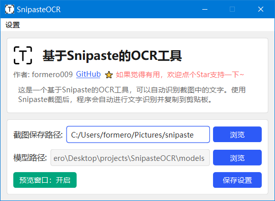
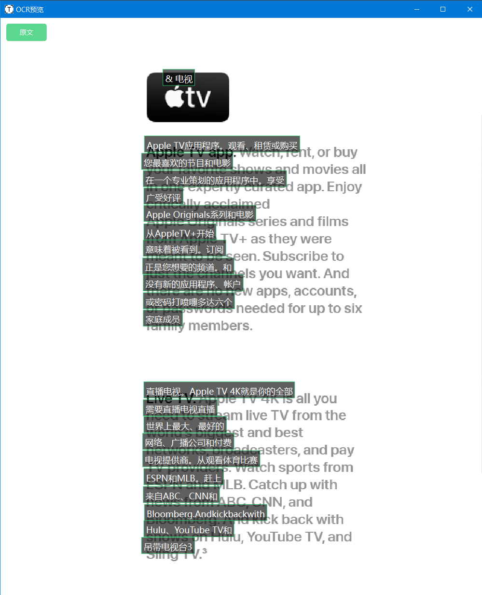
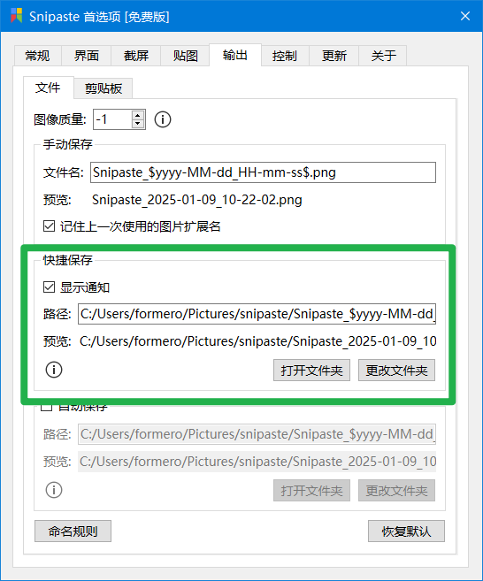
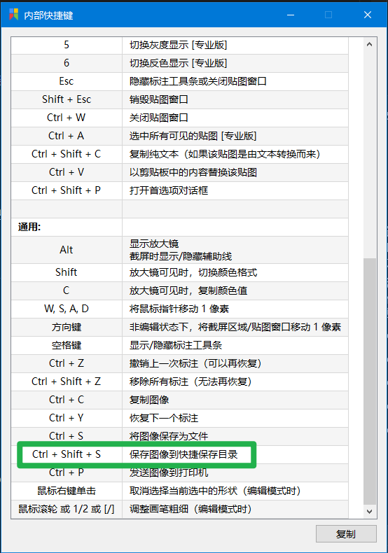

# SnipasteOCR

[](LICENSE)

基于 Snipaste 的截图文字识别工具，集成飞桨 OCR 模型，实现快速精准的文字识别。支持文本翻译功能，让截图识别更加便捷。
   
## 💻 程序界面

### 主界面


### 预览界面（支持翻译）


## ✨ 特性

- 🔍 截图自动文字识别
- 🌏 完整支持中英文识别
- 📋 识别结果自动存入剪贴板
- 🖼️ 可选的识别预览窗口，支持实时翻译
- 🚀 采用飞桨 OCR 模型，识别准确率高
- 🔧 基于 Snipaste 强大的截图功能
- 🌐 支持识别结果翻译功能

## 📝 使用前准备

- 安装 [Snipaste](https://www.snipaste.com/)
- Windows 操作系统

## 🚀 快速开始

1. **安装 Snipaste**
   - 从 [Snipaste 官网](https://www.snipaste.com/) 下载并安装

2. **设置 Snipaste 快捷保存路径（重要！）**
   - 这一步极其重要，因为程序通过监控保存目录来实现自动识别
   - Snipaste 的快捷保存路径必须与本程序设置的路径一致
   - Snipaste 默认快捷保存快捷键：`Ctrl+Shift+S`

   

3. **安装与运行**

   方式一：使用 UV（推荐）
   ```bash
   # 安装依赖
   uv sync
   
   # 运行程序
   uv main.py
   ```

   方式二：使用 pip
   ```bash
   # 安装依赖
   pip install -r requirements.txt
   
   # 运行程序
   python main.py
   ```

   方式三：一键安装
   - 运行 `install.bat` 进行一键安装打包
   
   方式四：直接使用
   - 从 [Releases](https://github.com/yourusername/SnipasteOCR/releases) 页面下载打包好的程序直接使用

4. **使用方法**
   - 使用 Snipaste 截图
   - 按下 `Ctrl+Shift+S` 保存截图
   - 识别结果会自动复制到剪贴板
   - 识别文本会在预览窗口显示（可在设置中关闭）
   - 在预览窗口中可以查看原文和翻译结果

   

## 🎯 识别效果

识别结果会按照截图的版式进行输出。飞桨 OCR 模型的识别准确率很高，支持多种版式的文字识别。如果有特殊文字识别需求，可以参考 [PaddleOCR](https://github.com/PaddlePaddle/PaddleOCR) 自行训练模型。

## 🤝 参与贡献

欢迎提交 Issue 和 Pull Request！

## 📬 反馈建议

如果你有任何问题或建议：
- 欢迎提交 Issue
- 欢迎提交 Pull Request
- 如果觉得项目有帮助，请点个 Star 支持一下！

## 📌 注意事项

1. 使用前必须正确设置 Snipaste 的快捷保存路径
2. 程序会将识别文字自动存入剪贴板，会覆盖截图的图片内容
3. 预览窗口可以在主界面中关闭

感谢大家的支持！如有问题请直接提 Issue，我会尽快解决。